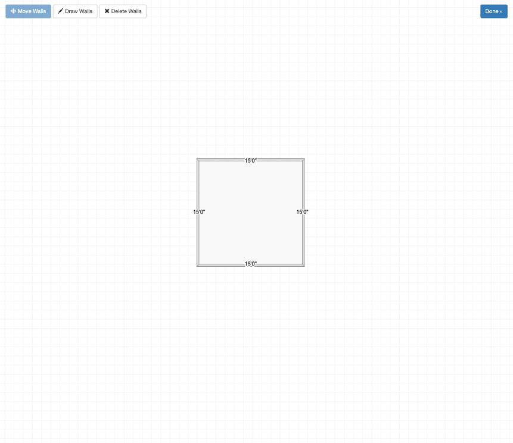
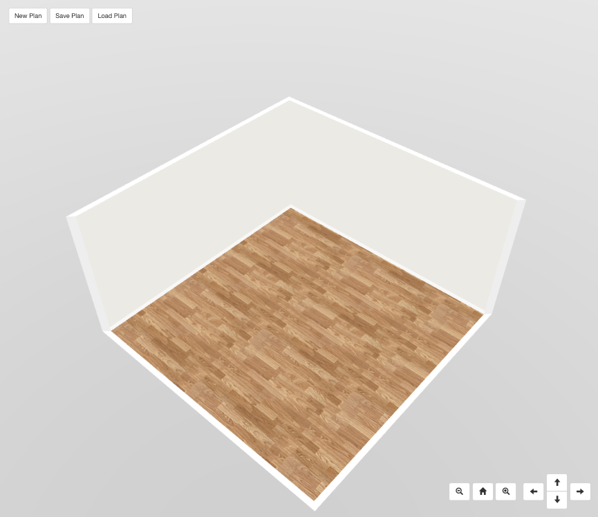
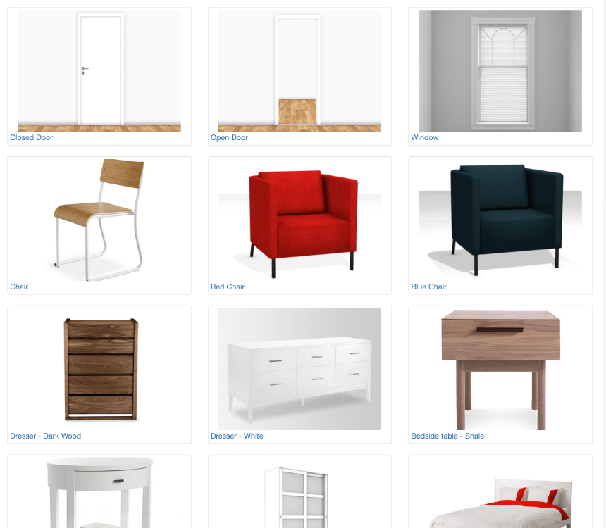

# Blueprint3D

A modernized 3D interior design application built on Three.js that allows users to create floor plans and design interior spaces.

**[🚀 Live Demo](https://linncharm.github.io/blueprint3d-modern/)**

This project is a comprehensive modernization of [furnishup/blueprint3d](https://github.com/furnishup/blueprint3d), originally created 9 years ago.

## Features

- **2D Floor Planning**: Create and edit floor plans with walls, doors, and windows
- **3D Visualization**: Real-time 3D rendering of interior spaces
- **Item Placement**: Add and arrange furniture and decorative items
- **Interactive Design**: Modify layouts and items in both 2D and 3D views

## Screenshots

<p align="center">
  
  <br><em>2D Floor Plan Editor</em>
</p>

<p align="center">
  
  <br><em>3D Design View</em>
</p>

<p align="center">
  
  <br><em>Item Selection and Placement</em>
</p>

## Modernization Updates

This fork includes significant modernization from the original project:

- **Three.js**: Upgraded from r69 to r181
- **Modern JavaScript**: Migrated to ES6+ syntax with TypeScript support
- **Build System**: Replaced Grunt with Vite for faster development
- **Dependencies**: Removed jQuery dependency from core
- **Code Quality**: Refactored with modern patterns and conventions

## Getting Started

### Prerequisites

- Node.js >= 20
- pnpm

### Installation

```bash
pnpm install
```

### Development

Start the development server:

```bash
pnpm dev
```

The application will open at `http://localhost:3000`

### Build

Build for production:

```bash
pnpm build:modern
```

The output will be in the `dist` directory.

### Preview Production Build

```bash
pnpm preview
```

## Project Structure

```
blueprint3d/
├── src/              # Core library source code
│   ├── core/         # Utilities and configuration
│   ├── floorplanner/ # 2D floor plan editor
│   ├── items/        # Furniture and item types
│   ├── model/        # Data models for floorplan and items
│   └── three/        # 3D rendering and controls
├── example/          # Demo application
│   ├── index.html    # Entry point
│   ├── js/           # Application scripts
│   ├── models/       # 3D model assets
│   └── textures/     # Texture assets
└── dist/             # Production build output
```

## Development Workflow

1. **Install dependencies**: `pnpm install`
2. **Start dev server**: `pnpm dev`
3. **Make changes**: Edit files in `src/` or `example/`
4. **Test changes**: Changes will hot-reload in the browser
5. **Build for production**: `pnpm build:modern`

## Deploy to GitHub Pages

### Automatic Deployment

This project is configured to automatically deploy to GitHub Pages when you push to the `main` branch.

**Setup Steps:**

1. Go to your GitHub repository settings
2. Navigate to **Pages** section (Settings → Pages)
3. Under **Build and deployment**, select:
   - **Source**: GitHub Actions
4. Push your changes to the `main` branch
5. The site will be available at: `https://yourusername.github.io/repository-name/`

The GitHub Actions workflow (`.github/workflows/deploy.yml`) will automatically:
- Install dependencies with pnpm
- Build the project
- Deploy to GitHub Pages

### Manual Deployment

If you prefer to deploy manually:

```bash
# Build the project
pnpm build:modern

# Deploy the dist folder to gh-pages branch
# (requires gh-pages package: pnpm add -D gh-pages)
npx gh-pages -d dist
```

## Legacy Build

The project still includes the original Grunt build system for compatibility:

```bash
pnpm build:old
```

## License

This project is open-source! See LICENSE.txt for more information.
